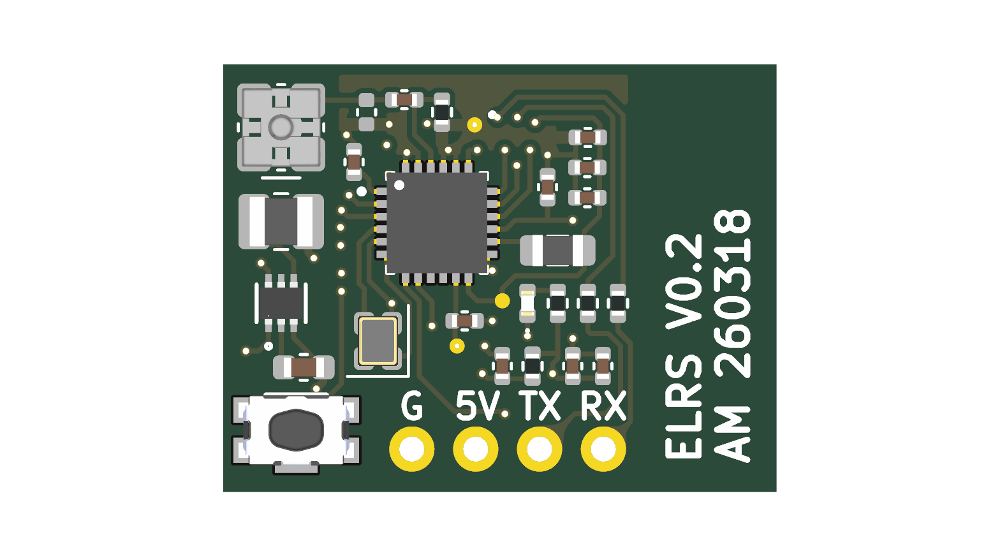
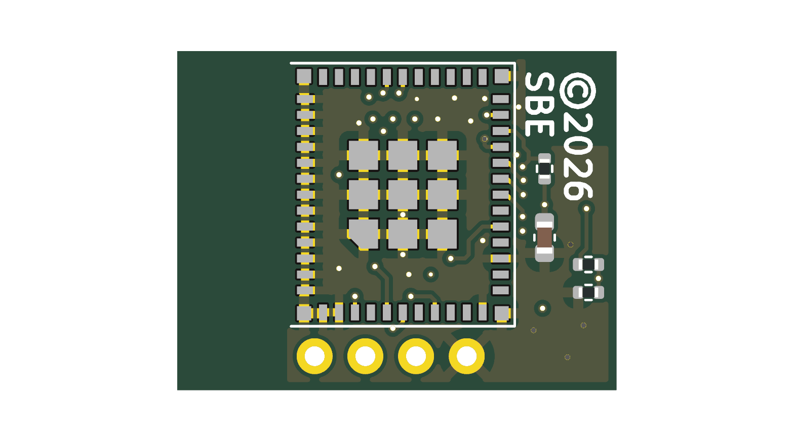

# SB ELRS V0.2
The SB ELRS V0.2 is a 2.4 GHz ExpressLRS receiver module for FPV drones.
This module has a single Semtech SX1280 receiver, Espressif ESP32-C3
processor, and built-in 2.4GHz ceramic antenna.
The CRSF serial interface is compatible with Betaflight FPV flight controllers.

## Board
| Front | Back |
|-------|------|
|  |  |

## Schematic
📄 [Schematic PDF](docs/schematic.pdf)

## Components
- **ESP32-C3-MINI-1-N4** (U2) — Espressif ESP32-C3 microcontroller module with 4MB flash
- **SX1280IMLTRT** (U1) — Semtech SX1280 2.4GHz LoRa/FLRC radio transceiver IC
- **AP61100Z6-7** (U3) — Diodes Inc. 1A synchronous buck converter for power regulation
- **0479480001** (AE1) — Molex RF/antenna connector
- **KMR221GLFS** (S1) — C&K side-actuated SMD tactile button
- **CS06016 52.0 MHz** (Y1) — 52MHz crystal oscillator (SX1280 reference clock)

## License
See [LICENSE.txt](LICENSE.txt).